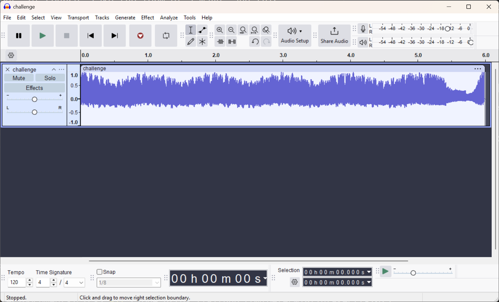
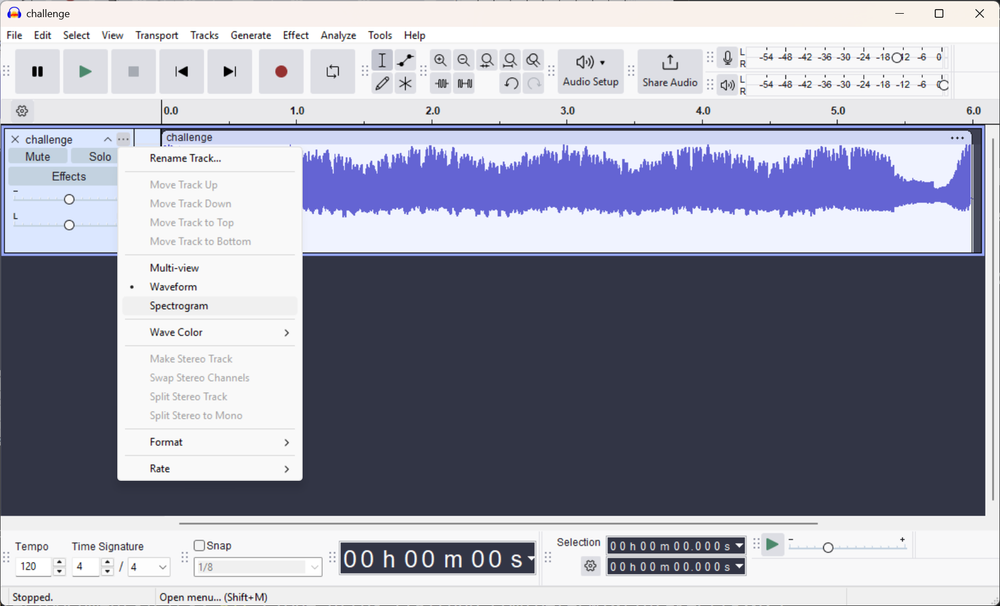
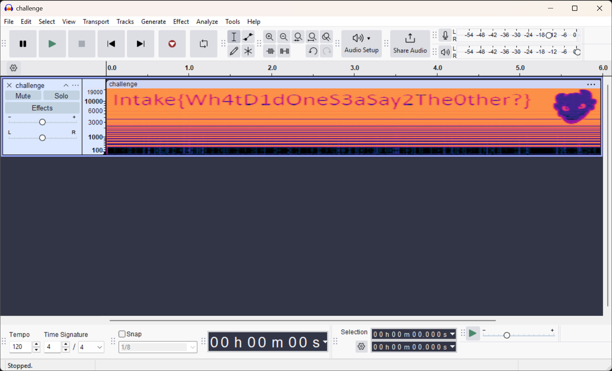
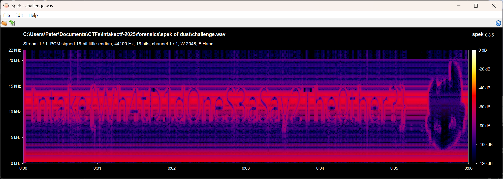

# Speck of Dust
A forensics challenge about audio and waveforms!

## Basics
Audio does, of course, take the form of a wave, and this can be visualised in many different programs: Audacity, Spek, and many more!

Just because its an audio file - doesn't have to be listened to!

Drop ```challenge.wav``` into software that will allow you to visualise the waveform!

## Using Audacity

Load the file into audacity, and you should be able to see the waveform.



Select the three dots (...) in the top-right of the **file** pane:



And finally, select **Spectogram**.

<details>
  <summary>Click to reveal solution</summary>

   
</details>

## Spek

Spek will directly reveal the waveform once you open ```challenge.wav```:

<details>
  <summary>Click to reveal solution</summary>

   
</details>

<hr />

Created by **Peter Walker**<br />
President | Warwick Cyber Security Society<br />
[https://www.linkedin.com/in/p3ter-w/](https://www.linkedin.com/in/p3ter-w/)